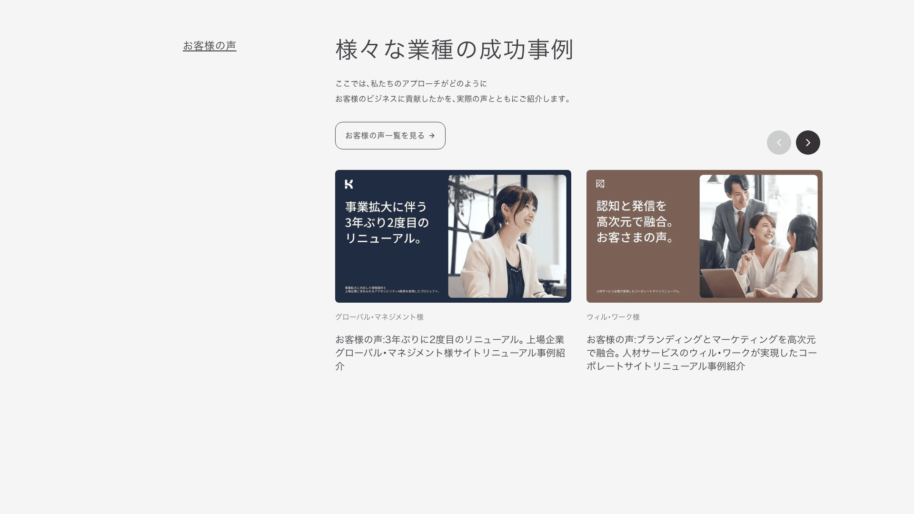

# Customer Voice Carousel Prototype

日本のコーポレートサイト向けに設計した、レスポンシブ対応の「お客様の声（Customer Voice）」カルーセルのプロトタイプです。

Next.js · Tailwind CSS v4 · TypeScript で構築しています。

カルーセルの実装には [Embla Carousel](https://www.embla-carousel.com/) を使用しています。

## デモ

## 想定ユースケース

次のようなサイトでよく見られる「お客様の声」セクションを想定しています。

- コーポレートサイト
- サービスのランディングページ
- 物流会社のサイト
- SaaS プロダクトページ
